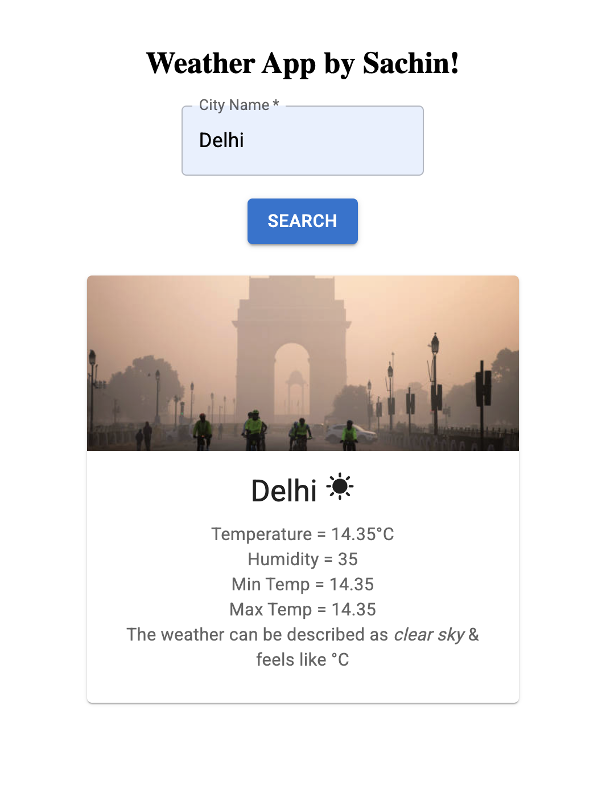

# Weather App 🌦️

A simple and responsive weather application built using **React + Vite** and **Material UI** that allows users to search any city and get real-time weather updates from the **OpenWeather API**.

---

## 🚀 Features

- Search weather by city name
- Real-time weather fetch using `fetch()` and async/await
- Displays:
  - Current temperature
  - Humidity
  - Min/Max temperature
  - Feels like temperature
  - Weather description
- Dynamic weather image rendering based on:
  - Temperature
  - Humidity
- Weather icons change based on condition
- Simple, clean Material UI styling

---

## 🧩 Components & Concepts Used

### **1. Lifting State Up**
- `WeatherApp.jsx` manages main weather state and updates via `updateInfo()`
- `SearchBox` → fetches API and returns data back to parent

### **2. Controlled Components**
- `SearchBox` uses controlled `<TextField />` for input handling with `useState`

### **3. API Integration**
- OpenWeather API:
https://api.openweathermap.org/data/2.5/weather?q={city}&appid={API_KEY}&units=metric


### **4. Async Programming**
- `async/await` + `fetch()` for API calls
- Error handling with fallback UI state

### **5. Conditional Rendering**
Used for:
- Weather icons
- Weather background images
- Error message display

Example conditions:
```js
info.humidity > 80 (Rain)
info.temp > 15    (Cold)
else              (Hot)
```

### **6. Material UI Components**

Used:

- Card
- CardMedia
- CardContent
- Typography
- TextField
- Button
- Icons: `SunnyIcon`, `ThunderstormIcon`, `AcUnitIcon`

---

## 🏗️ Project Structure
```css
src/
 ├─ WeatherApp.jsx     → Main parent container
 ├─ SearchBox.jsx      → Input + API fetch component
 ├─ InfoBox.jsx        → Display weather details UI card
 ├─ App.jsx            → Renders WeatherApp
```

---

## 🔑 OpenWeather API Setup

**1.** Create API key from **OpenWeather**

**2.** Replace:
```js
const API_KEY = "YOUR_API_KEY"
```

---

## 🎨 UI/UX Behavior

| Condition     | Display                        |
| ------------- | ------------------------------ |
| Humidity > 80 | Thunderstorm icon + Rain image |
| Temp > 15°C   | Snowflake icon + Cold image    |
| Else          | Sunny icon + Heat image        |

---

## 📷 Screenshot


